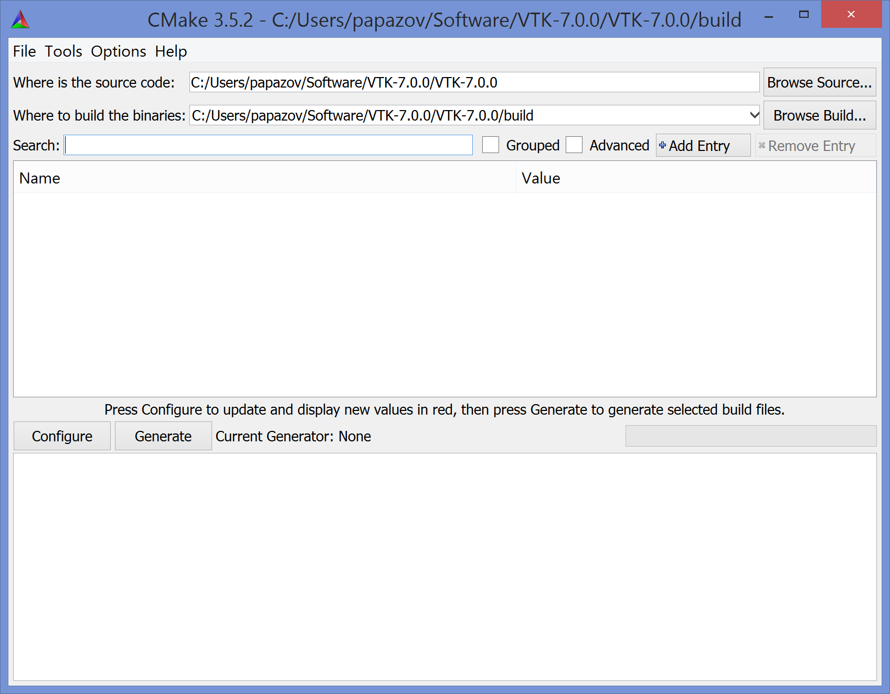

# Installation

Invipy is written in Python3 and uses PyQt5 and VTK.

## Windows

### PyQt5
Open a command prompt (eventually as admin) and type in:

    pip install PyQt5

### VTK

We build VTK from source using cmake and a Windows compiler. Here, we employ Visual Studio Express 2013 for desktop (it is free).

* Install cmake and VS Express 2013 for desktop.
* Download the latest stable VTK source code from http://www.vtk.org/download/
* Unzip the file, enter the main directory and create a new one (usually called **build**).
* Open cmake and fill the first two lines as shown in the screenshot:

*** Linux ***

Adjust some environment variables (for cshell in Linux):
setenv LD_LIBRARY_PATH /local/usr/vtk7/lib
setenv PYTHONPATH /local/usr/vtk7/lib/python2.7/site-packages:/local/usr/vtk7/lib/python2.7/site-packages/vtk

*** Windows ***

Add to Path variable (this is where the VTK DLLs are located):
C:\Program Files\VTK\7.0.0-no-qt\bin

Add to PYTHONPATH variable:
C:\Program Files\VTK\7.0.0-no-qt\lib\python3.5\site-packages\vtk;C:\Program Files\VTK\7.0.0-no-qt\lib\python3.5\site-packages
