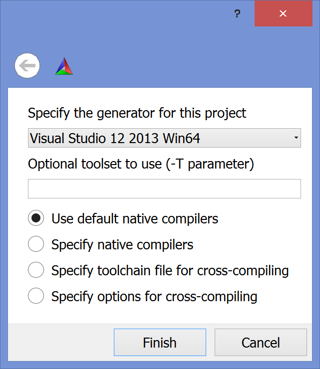
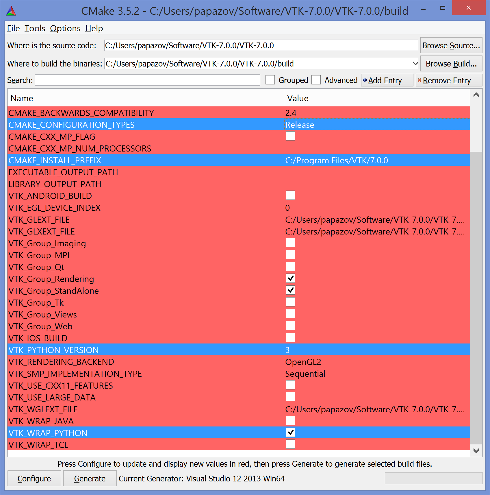
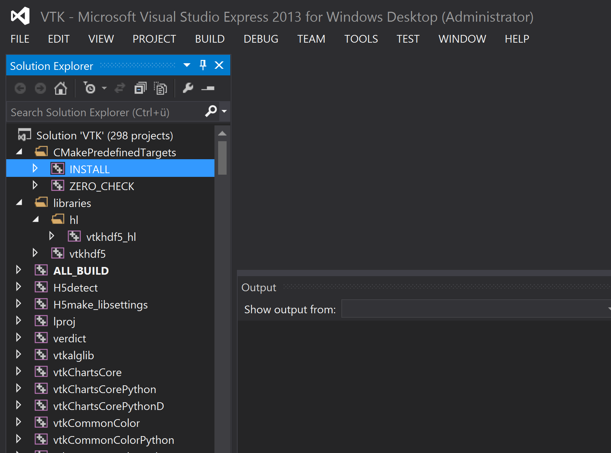

# Installation

Invipy is written in Python3 and uses PyQt5 and VTK.

## Windows

We use a 64 bit Windows8.

### PyQt5
Open a command prompt (eventually as admin) and type in:

    pip install PyQt5

### VTK

We build VTK from source using CMake and a Windows compiler (here, we employ the freely available Visual Studio Express 2013 for desktop).

* Install CMake and VS Express 2013 for desktop.
* Download the latest stable VTK source code (in this manual it is 7.0.0) from http://www.vtk.org/download/
* Unzip the file, enter the main directory and create a new one (usually called **build**).
* Open CMake and fill the first two lines as shown in the screenshot:

* Hit **Configure** and set up the dialog which pops up as shown here:

* Hit **Finish**. CMake starts the configuration process. Once it is done, change the blue marked entries as shown here:

* Hit **Configure** again and when it's done hit **Generate**. Close CMake when the generating is done.
* Go to the **build** directory and open the **VTK.sln** file with VS Express 2013 (eventually as admin).
* Right-click on **INSTALL** and select **Build**:

* It takes a while to build VTK. At the end, it should be in **C:\Program Files\VTK\7.0.0**.

*** Linux ***

Adjust some environment variables (for cshell in Linux):
setenv LD_LIBRARY_PATH /local/usr/vtk7/lib
setenv PYTHONPATH /local/usr/vtk7/lib/python2.7/site-packages:/local/usr/vtk7/lib/python2.7/site-packages/vtk

*** Windows ***

Add to Path variable (this is where the VTK DLLs are located):
C:\Program Files\VTK\7.0.0-no-qt\bin

Add to PYTHONPATH variable:
C:\Program Files\VTK\7.0.0-no-qt\lib\python3.5\site-packages\vtk;C:\Program Files\VTK\7.0.0-no-qt\lib\python3.5\site-packages
