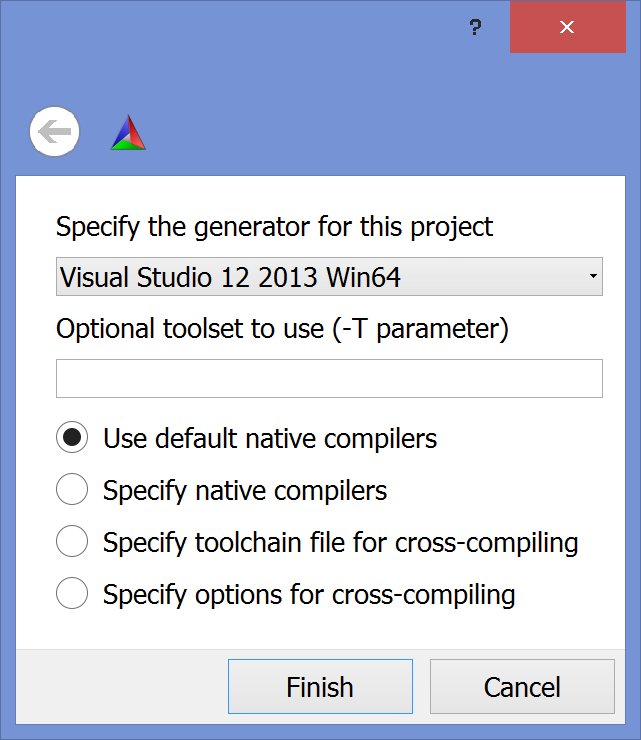

# Install VTK on Windows

We build VTK from source using CMake and a Windows compiler (here, we employ the freely available Visual Studio Express 2013 for desktop).

* Install CMake and VS Express 2013 for desktop (this is trivial).
* Download the latest stable VTK source code (in this manual it is 7.0.0) from http://www.vtk.org/download/
* Unzip the file, enter the main directory and create a new folder (usually) called **build**.
* Open CMake and fill in the first two lines as shown in the screenshot (you should change **C:\Users\papazov\Software** to the folder where you downloaded VTK):

* Hit **Configure** and set up the dialog which pops up as shown here:

* Hit **Finish**. CMake starts the configuration process. Once it is done, change the blue marked entries to the shown vaules:

* Hit **Configure** again and when it's done hit **Generate**. Close CMake when the generating is done.
* Go to the **build** directory and open the **VTK.sln** file with VS Express 2013 (eventually as admin).
* Right-click on **INSTALL** and select **Build**:

* It takes a while to build VTK. At the end, it should be in **C:\Program Files\VTK\7.0.0**.
